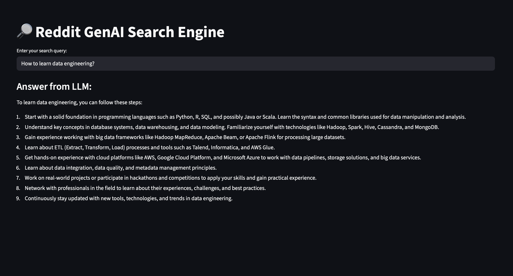

## Reddit GenAI Pipeline 🚀

[](https://github.com/Narasimhag/reddit-genai-pipeline/actions/workflows/pipeline.yml)

This project aims to build an end-to-end GenAI powered pipeline using Reddit data.
- [x] **Extract**: Collect raw Reddit data from the API.
- [x] **Clean**: Preprocess text (normalize, remove noise, structure metadata).
- [x] **Vectorize**: Generate TF-IDF features and sentence embeddings for text.
- [x] **Store & Index**: Load vectors + metadata into a vector database.
- [x] **Retrieve**: Implement semantic search across Reddit posts using embeddings.
- [x] **Rerank & Search**: Re-rank retrieval results with a cross-encoder and return most relevant docs.
- [x] **Generate**: Feed top-ranked results into a GenAI model (LLaMA) for contextual Q&A
- [x] **Deploy**: Wrap the pipeline in a streamlit app.
- [ ] **Optimize**: Experiment with batching, efficient storage and larger models.
- [ ] **Scale**: Containerize with Docker + orchestrate with Prefect.

## Step 1: Extract
- Input: None
- Process: Use praw library to get top 100 posts of subreddits
- Output: Create data files to location '/data/raw'

## Step 2: Clean
- Input: Multiple raw Reddit CSVs from '/data/raw'
- Process: Combines all files, cleans text (lowercasing, remove URLs/punctutation), adds features (text length, posting day)
- Output: Single processed dataset in'/data/processed/reddit_posts_cleaned.csv'

## Step 3: Vectorize
- Implemented 'vectorize.py' to transform cleaned reddit posts into numerica representations:
    - **TF-IDF vectors** for sparse, interpretable features.
    - **Sentence embeddings** for dense, semantic features.
- Both outputs are saved as Parquet files
- Metadata columns are retained to allow future analysis and joinin with vectorized features.

## Step 4: Index
- Added `index.py` to store embeddings + metadata in pinecone.
- Created `reddit-genai` index (cosine similarity, 384 dim).
- Uploaded vectors and verified in Pinecone dashboard.

## Step 5: Retrieve
- Once the embeddings are indexed in Pinecone, run queries against them
- `retrive.py` script, converts the query results into a structured dataframe

## Step 6: Rerank & Search
- Rerank the results that are retrived using cross-encoder
- `rerank.py` script builds a rerank class that ranks them using cross encoder, improving precision for recall.
- `search.py` -> integrates retriever + reranker into full pipeline

## Step 7: Generate
- The reranked docs are used by the Ollama mistral model, run locally to generate responses for the query.
- Uses only the retireved docs to prevent hallucination.

## Step 8: 🚀 Interactive Search App

A Streamlit-based app to explore the pipeline end-to-end.



### Run Locally
```bash
streamlist run app.py
```
## 🚀 Orchestration & Scheduling

This project now runs as a **scheduled pipeline** using Github Actions.

### Workflow
- **Trigger:** Everyday at 9 AM UTC (configurable via cron)
- **Steps:**
    1. Fecth new Reddit posts (`extract.py`)
    2. Clean text (`transform.py`)
    3. Vectorize (TF-IDF + Embeddigs) (`vectorize.py`)
    4. Upsert into Pinecone index (`index.py`)

### Outputs
- Artifacts: Cleaned and vectorized files are uploaded to each workflow run
- Pincecone: New embeddings are automatically indexed

### Secrets Required
Store these in your Github repo under **Settings --> Secrets --> Actions**:
- `CLIENT_ID`
- `CLIENT_SECRET`
- `PINECONE_API_KEY`

### Running Locally
You can still run the pipeline manually:
```bash
python src/extract.py
python src/transform.py
python src/vectorize.py
python src/index.py
```


